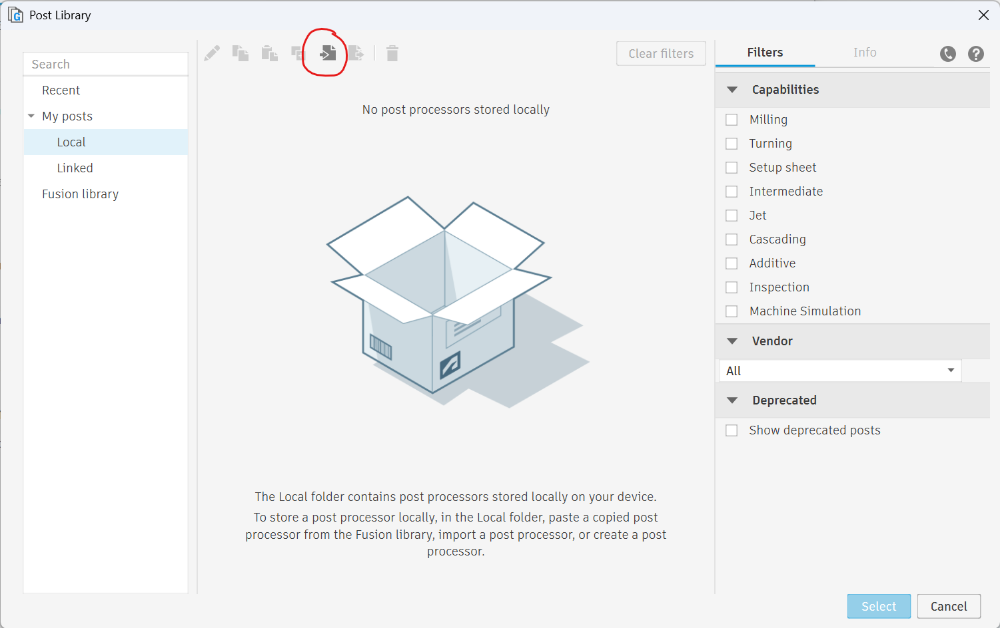
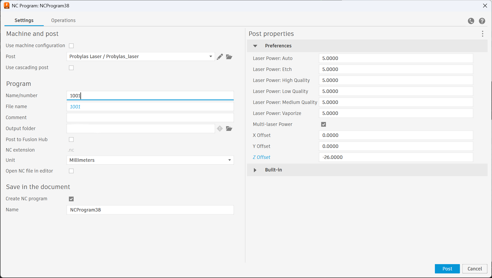
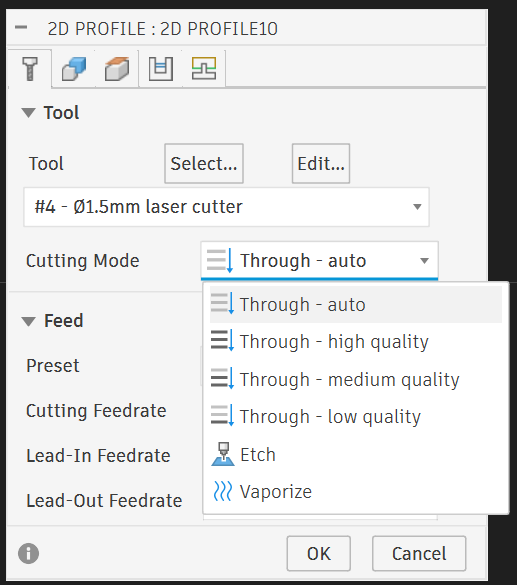

# Probylas Turnkey post
Barebone post processor for the Probylas Turnkey. It supports independent feed-rates per cutting operation (set using the tool feed), 6 customizable laser powers, and point welding.

## How to install
The Probylas post processor can be installed by importing it from the "Post Library" menu. After which, you can select the Probylas_laser.cps from this git repository.

## How to use
### Parameters
This preprocessor uses several parameters, which can be found under "Preferences":
* Dwell time - Dwell time for point welding (see "Point welding section) in seconds
* Laser Power : Auto - Laser power (in W) to be used in the "Through - Auto" Cutting mode
* Laser Power : Etch - Laser power (in W) to be used in the "Etch" Cutting mode
* Laser Power : High Quality - Laser power (in W) to be used in the "Through - High Quality" Cutting mode
* Laser Power : Low Quality - Laser power (in W) to be used in the "Through - Low Quality" Cutting mode
* Laser Power : Medium Quality - Laser power (in W) to be used in the "Through - Medium Quality" Cutting mode
* Laser Power : Vaporize - Laser power (in W) to be used in the "Vaporize" Cutting mode
* Use Post processor laser powers : Whether to use the values set above for the laser power. If false, the Probylas software power will be used
* X Offset : X-Offset to apply to coordinates to center the contours on the Probylas window (Center of window is at (0,0))
* Y Offset : Y-Offset to apply to coordinates to center the contours on the Probylas window (Center of window is at (0,0))
* Z Offset : Focal position of the laser.

### Setting laser power
To use a certain laser power, make sure to check "Use Post processor laser powers". Then for each of the 2D cutting profiles, you can set the mode using the dropdown. Note that the labels are arbitrary, you can set the power of the "Etch" mode higher than the "Vaporize" mode, whereas one would expect to need more energy to vaporize a material than to etch it.

### Feeds
This post-processor uses the tool feeds. The feeds can be provided in various units, but not in mm/s, which the Probylas expects. **This post-processor takes care of the conversion, so please the correct units.** If you want a feed of 10 mm/s, provide e.g. 600 mm/min, which this post-processor will convert to F10 (= 10 mm/s).

### Spot welding
This preprocessor supports spot welding, although via a slightly unconventional way.
To perform a series of spot welds, connect the spot weld locations using lines.
Create a new cuttin operation and select the open chain as geometry for the operation.
In the "Passes" tab, set the tolerance to 0.001 mm, and sideways compensation to "Center".
Since this is not a smooth cutting operation, there is no need for lead-in or lead-outs in the "Linking" tab.
Next, rename the cutting operation to "spotweld" (not case-sensitive).
This allows the post-processor to detect these are spot welds.
**If you don't set the cutting operation name to "spotweld", the entire trajectory will be welded, not only the spots!!!**
Lastly, set the post processing parameter "Dwell time" to the spot weld time (in seconds).